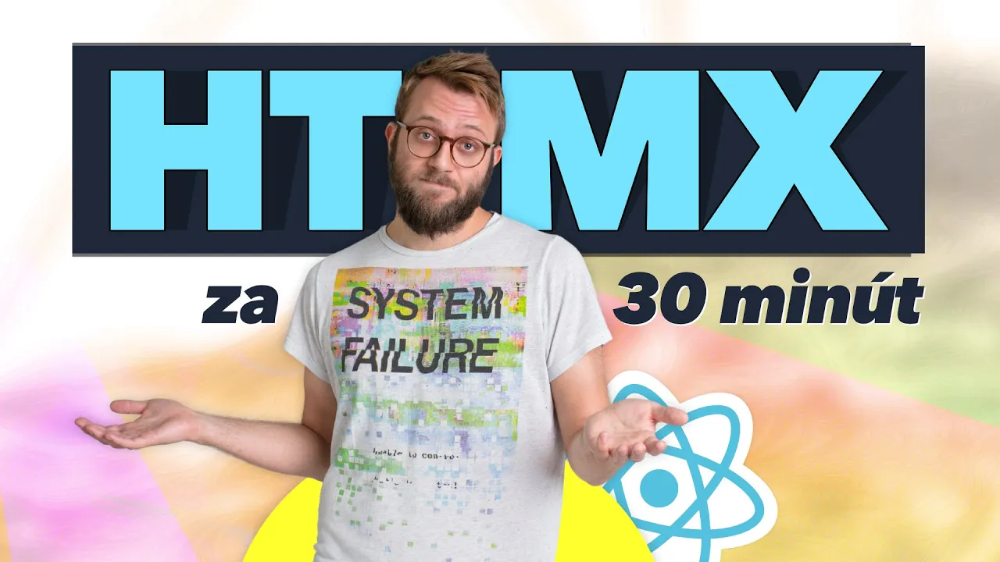

# HTMX kurz ✨ možno nepotrebuješ React ❗️

**Frontend je komplikovaný. A zvykol byť jednoduchý. A vďaka HTMX znova bude.**  
V HTMX robíš reaktívny frontend bez písania JavaScriptu.  
Web funkčný ako React, kód jednoduchý ako HTML.  

Pre mňa (a podľa jeho tvorcu) HTMX nie je ďalší JS framework. HTMX je rozšírenie jazyka HTML o zopár schopností, ktoré mal vždy mať. A ak by ich mal, na mnohé by sme nepotrebovali React. A keď hovorím React, myslím Vue, Angular, Svelte... jedna banda. Skvelé nástroje, ale dnes ich používame automaticky a na všetko. Často nie sú potrebné. Na mnohé úlohy sú prehnane komplikované.

**Skús HTMX a možno zistíš, že ich nepotrebuješ.** Napíšeš menej kódu a ten bude jednoduchší. A žiadne nastavovanie, konzola, npm, build step, bundler, inštalátor, hydratácia... nič, len HTML;)

Ak sa ti kurz páči, pozvi ma na kávu cez PATREON ♥️ https://www.patreon.com/yablko.  
A dostaneš ďalšie kurzy skôr. Aj v textovej podobe.  

---

### HTMX kurz, zdarma ✨  
:: https://youtu.be/jAh04sd1Fxw

---

**HTMX**  
https://htmx.org  
https://htmx.org/examples  
  
**KNIHA A ESEJE:** prečo HTMX? kedy? kedy nie?  
https://htmx.org/essays  
https://hypermedia.systems  
https://grugbrain.dev (humor)  
  
**ALTERNATÍVY:** iní ľudia, rovnaký impulz  
https://unpoly.com  
https://hotwired.dev  
https://laravel-livewire.com  
https://hyperview.org (mobile)  
  
**CARSON GROSS:** rozhovory a prednášky tvorcu HTMX  
https://www.youtube.com/watch?v=9H5VK9vJ-aw   
https://www.youtube.com/watch?v=u2rjnLJ1M98  
https://www.youtube.com/watch?v=cBfz4W_KvEI  
https://www.youtube.com/watch?v=L_UWY-zHlOA  
https://www.youtube.com/watch?v=mmzc3auHSEQ  
https://www.youtube.com/watch?v=LRrrxQXWdhI  
https://www.youtube.com/watch?v=Jodkvyo5DbA  
  
---

☕️ PATREON https://patreon.com/yablko  
🎙 PODCAST https://youtu.be/DktmaHXd4ps  
🍿 TWITCH https://twitch.com/yablko_  
🎬 YOUTUBE 2 https://youtube.com/yablko  
📸 INSTAGRAM https://instagram.com/yablko  
👍 FACEBOOK https://www.facebook.com/yablko.smrdi  
🐦 TWITTER https://twitter.com/yablko  
📚 BLOGY https://medium.com/@yablko  
  
📚 Všetky moje skillmea (learn2code) kurzy  
:: https://skillmea.sk/lektor/roman-hraska 1500+ videí  

♥️
